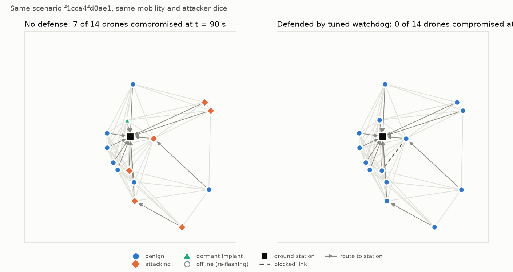
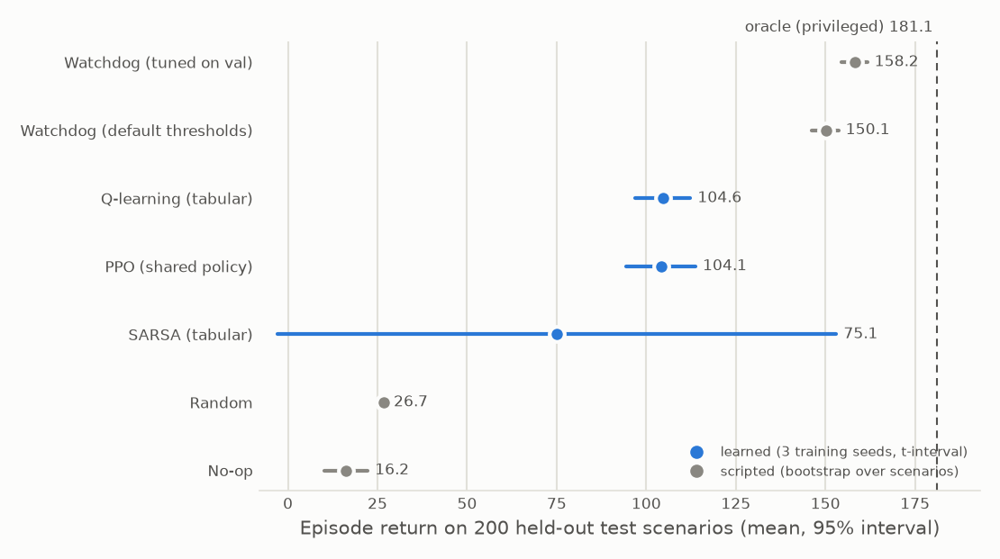
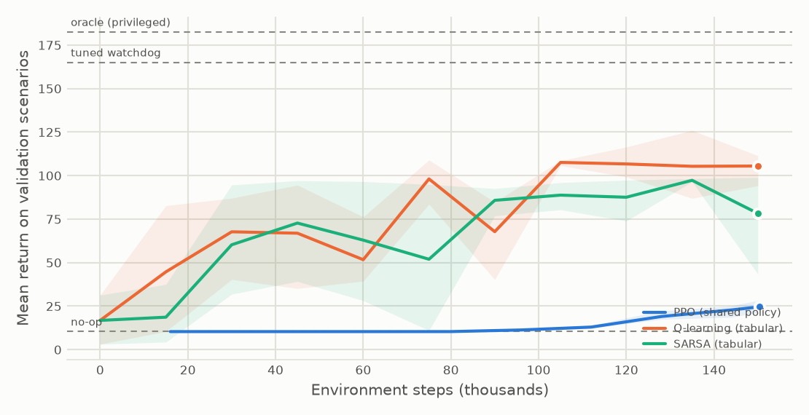

# fanet-defense-gym

**A procedurally generated, partially observable cyber-defense environment for drone swarms,
with scripted and learned baselines and an evaluation protocol that reports honest uncertainty.**

<picture>
  <source media="(prefers-color-scheme: dark)" srcset="docs/figures/snapshot_dark.png">
  
</picture>

Drones relay telemetry to a ground station over an ad hoc network. Some of them carry
supply-chain implants that wake up later, attack the routing (blackhole, greyhole,
flooding) and spread to neighbours. One local blue agent per drone sees only noisy local
telemetry and can block a neighbour for a while or re-flash its own drone. The question is
the one every operator faces: **contain compromised nodes without destroying the service you
are protecting.**

## What is in the box

* **Environment**: PettingZoo `ParallelEnv` (one agent per drone, shared spaces, so one
  policy serves swarms of any size); roughly 1 to 2 ms per step in pure numpy.
* **Language-model interface**: the same scenarios as text prompts with JSON answers and
  verifiable rewards (Gymnasium `Text` spaces), a sharded generator of prompt / teacher answer
  / reward records, and a minimal client for OpenAI-compatible endpoints such as Mistral's API.
* **Scenario generation at scale**: every episode is a `ScenarioSpec` (JSON, content hash)
  drawn from difficulty profiles; `train` / `val` / `test` are disjoint seed namespaces;
  suites shard deterministically across workers or Kubernetes pods.
* **No label leakage by construction**: observations come from calibrated noisy evidence
  (host anomaly score, watchdog overhearing, delivery feedback); only explicitly privileged
  baselines can read hidden state, and tests pin that boundary.
* **Baselines**: no-op, random, the classic watchdog heuristic (default and tuned on
  validation), tabular Q-learning and SARSA, PPO with parameter sharing, privileged oracle.
* **Evaluation harness**: paired scenarios, multiple training seeds, bootstrap and Student-t
  intervals, out-of-distribution families, reward-hacking tests.
* **Engineering**: typed package, CLI, 108 tests, GitHub Actions (lint, types, tests on
  3.10 to 3.12, Docker build, Kubernetes manifest validation), non-root Docker image,
  Indexed Kubernetes Jobs for sharded generation and evaluation.

## Quickstart

```bash
pip install -e ".[dev,train,viz]"        # Python 3.10+
pytest -m "not slow"                      # the test suite
fanet-defense evaluate --policy watchdog --n 50 --workers 4
fanet-defense train --algo ppo --steps 300000 --out runs/ppo_seed0
fanet-defense evaluate --policy ppo:runs/ppo_seed0/policy.npz --n 50 --workers 4
fanet-defense generate-suite --n 8000 --split train --out data/train.jsonl
```

Using the environment directly:

```python
from fanet_defense import ScenarioSampler
from fanet_defense.env_parallel import FanetParallelEnv

env = FanetParallelEnv(sampler=ScenarioSampler("hard"))
obs, infos = env.reset(seed=0)
while env.agents:
    actions = {agent: env.action_space(agent).sample() for agent in env.agents}
    obs, rewards, terminations, truncations, infos = env.step(actions)
```

## Language-model interface

The text view gives a central defender exactly the local evidence the drone agents see, as
numbers and fixed tokens only (no free text from the environment, so no prompt-injection
channel). A prompt at t = 40 s, and the watchdog heuristic's answer (default thresholds):

```text
t=40/200 | drones=8
drone anomaly delivery neighbours(id:forwarding%)
d00 -0.37 1.00 d05:100 d02:100
d01 -0.22 1.00 d02:100 d06:100
d02 +0.39 0.99 d01:75 d00:100 d05:100 d06:99
d03 -0.16 0.92 -
d04 offline (re-flashing)
d05 +0.35 0.97 d00:100 d02:100
d06 +0.05 0.63 d07:100 d01:74 d02:100
d07 +0.23 0.53 d06:98
```

```json
{"actions": []}
```

Answers are parsed defensively (bad JSON, unknown drones, illegal targets and duplicates are
ignored and counted, with an optional penalty), and the reward is computed by the simulator,
so it is verifiable. A test checks that playing a policy through text gives exactly the same
return as playing it on the numeric environment.

```python
from fanet_defense import ScenarioSampler
from fanet_defense.llm import ChatCompletionsDefender, run_text_episode
from fanet_defense.text_env import FanetTextEnv

env = FanetTextEnv(sampler=ScenarioSampler("medium"), decision_interval=5)
defender = ChatCompletionsDefender(model="mistral-small-latest")  # reads MISTRAL_API_KEY
episode = run_text_episode(env, defender, seed=0)
```

```bash
# Supervised and RL training records from a teacher policy, one shard per worker or pod
fanet-defense dataset --n 1000 --split train --teacher watchdog --interval 5 \
    --shard 0 --num-shards 8 --out data/sft-shard-0.jsonl
```

No language model has been evaluated in this repository yet; the interface, the parser and
the record generator are what is tested.

## The environment in one minute

| | |
|---|---|
| **Attacks** | dormant implants wake up, then act as *blackhole* (forge routes, drop everything), *greyhole* (drop a share of relayed traffic) or *flooder* (jam neighbours); awake implants exploit reachable neighbours; some lie low (stealth) |
| **Confounders** | healthy but unreliable relays (battery, saturation), lossy links |
| **Observation** (19 floats) | host anomaly score, own delivery ratio, time, and for the 4 nearest neighbours: presence, distance, overheard forwarding ratio, already blocked |
| **Actions** (6) | no-op, block neighbour k for 25 s, re-flash this drone (20 s offline, then clean) |
| **Reward** (team) | mission availability (benign, online drones whose telemetry reaches the station) minus small costs for active threats, actions and false blocks |
| **Difficulty knobs** | swarm size, radio density, implant share, spread rate, stealth, detector quality `d'`, link loss, share of flaky relays, attack mix |

The full contract, assumptions and limitations are in [docs/design.md](docs/design.md);
the decisions behind them are recorded as [ADRs](docs/adr/).

## Results

Generated by `scripts/run_experiments.py` and `scripts/make_figures.py`; the table below is
rewritten from `results/summary.json`, never typed by hand.

<!-- results:start -->
Held-out test suite of 200 scenarios, identical for every policy. Learned policies: 3 training seeds x 150,000 environment steps, mean over seeds with a Student-t 95 % interval; PPO acts stochastically (chosen on validation). Scripted policies: bootstrap 95 % interval over scenarios.

| Policy | Return | Availability | Compromised share | False blocks | Contained |
|---|---|---|---|---|---|
| No-op | 16.2 [10.2, 22.3] | 0.196 | 0.575 | 0.0 | 2 % |
| Random | 26.7 [26.0, 27.5] | 0.147 | 0.022 | 129.1 | 100 % |
| Watchdog (default thresholds) | 150.1 [146.2, 153.7] | 0.756 | 0.059 | 5.1 | 94 % |
| Watchdog (tuned on val) | 158.2 [154.5, 161.7] | 0.797 | 0.070 | 4.4 | 94 % |
| Q-learning (tabular) | 104.6 [96.9, 112.3] | 0.551 | 0.091 | 200.7 | 90 % |
| SARSA (tabular) | 75.1 [-2.9, 153.1] | 0.394 | 0.042 | 168.2 | 99 % |
| PPO (shared policy) | 104.1 [94.5, 113.7] | 0.565 | 0.213 | 196.5 | 57 % |
| Oracle (privileged) | 181.1 [179.6, 182.3] | 0.905 | 0.017 | 0.0 | 100 % |
<!-- results:end -->

Full tables (out-of-distribution families, paired differences, per-seed numbers):
[docs/results.md](docs/results.md).

<picture>
  <source media="(prefers-color-scheme: dark)" srcset="docs/figures/results_test_dark.png">
  
</picture>

<picture>
  <source media="(prefers-color-scheme: dark)" srcset="docs/figures/learning_curves_dark.png">
  
</picture>

## How the benchmark was made honest

These are the checks I wanted to be able to answer in front of a sceptical reviewer:

* **Can a policy cheat by reading labels?** No: observations are computed from noisy
  evidence only; a test keeps the anomaly score's AUC close to its theoretical value (about
  0.86), informative but far from an oracle.
* **Can blanket actions game the reward?** No: "block everything", "re-flash everything"
  and "do nothing" all score below the watchdog heuristic; invalid actions are bit-for-bit
  no-ops (tests).
* **Is the comparison fair?** Same scenarios for every policy, same interaction budget for
  every learner, thresholds and hyper-parameters chosen on validation, test touched once,
  several training seeds (3 in the published laptop run, 5 with `make repro`), intervals
  reported.
* **Does it generalise?** Three out-of-distribution families (larger swarms, flood-heavy,
  stealthy) are reported next to the in-distribution test set.

The calibration story (why availability counts offline drones, why a re-flash costs 20
steps) is in [ADR 0003](docs/adr/0003-reward-availability.md): the first reward I wrote let a
random policy beat "do nothing" by a wide margin, which is exactly the kind of flaw an
environment author has to catch before any agent is trained on it.

## Scaling out

`fanet-defense generate-suite --shard i --num-shards N` and
`fanet-defense evaluate --shard i --num-shards N` split a suite into disjoint shards whose
union is the full suite. [k8s/](k8s/) runs them as Indexed Jobs (non-root, read-only root
filesystem, no service-account token, all capabilities dropped); `docker build .` produces
the image.

## Limitations

Abstract link model (no MAC layer, instant route convergence), scripted attackers, one
defender per drone without messaging, a calibrated anomaly score instead of a trained IDS.
Results say nothing about real drones. See [docs/design.md](docs/design.md#9-limitations).

## Roadmap

* Evaluate open-weight and API language models on the text interface, with a fixed call
  budget and the same paired scenarios as the RL baselines.
* Imitation then reinforcement (warm-start PPO from the watchdog), the RL analogue of
  supervised fine-tuning followed by RL.
* An adaptive (learned) attacker; inter-agent messages.
* A pinned reproduction of TTCP CAGE Challenge 3 (CybORG) for comparison.

## Background and disclosure

I am Riad Chemali, PhD in cybersecurity of control systems (Université de Lille, 2021).
From 2024 to 2026 I led an internal R&D project on autonomous cyber defense for UAV fleets
at Akkodis Research. This repository is an **independent reimplementation, written in 2026
from public knowledge**: it contains no employer code, data, figures or results. The
problem framing follows the public TTCP CAGE Challenge 3 scenario.

It was developed with an AI coding assistant (Claude Code) as pair programmer; the design
decisions are recorded in the ADRs, and the code, tests and results were reviewed by me.

## Acknowledgements and references

TTCP CAGE Challenges and CybORG (MIT) for the problem framing; RFC 3561 (AODV); Marti et
al., MobiCom 2000 (watchdog and pathrater); Schulman et al. (PPO, GAE); CleanRL for the
single-file PPO style; PettingZoo and Gymnasium. Full references in
[docs/design.md](docs/design.md#10-references).

## License

MIT, see [LICENSE](LICENSE).
